# Boogeyman DFIR Investigation

## Overview

This investigation analyzes a simulated security incident involving a phishing email that led to system compromise, attacker enumeration activity, and data exfiltration. The objective was to analyze provided forensic artifacts and reconstruct the attacker’s actions.

Artifacts analyzed during this investigation included:

- Email artifact (`dump.eml`)
- Network capture (`capture.pcapng`)
- Windows Event Logs (`powershell.evtx`)
- Parsed PowerShell logs (`powershell.json`)

Through analysis of these artifacts, the attacker’s activity was reconstructed, including:

- Initial phishing delivery
- PowerShell execution
- Tool download and system enumeration
- Access to sensitive user data
- Data exfiltration using DNS tunneling

---

# 1. Phishing Email Analysis

The investigation began by analyzing the suspicious email contained in `dump.eml`.

The email originated from a suspicious domain and contained a password-protected attachment designed to bypass email security filters.

### Email Sender

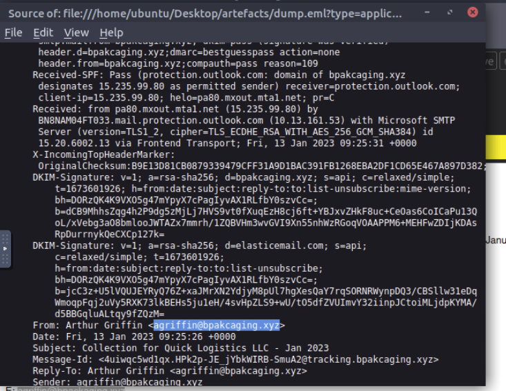

### Email Recipient

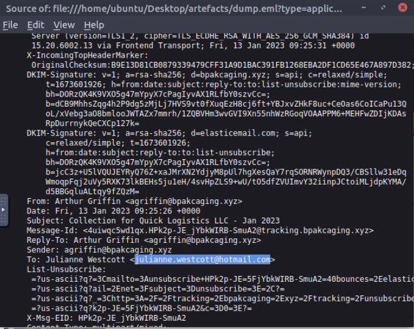

### DKIM Signature Analysis

The email header revealed that the DKIM signature originated from a third-party domain.

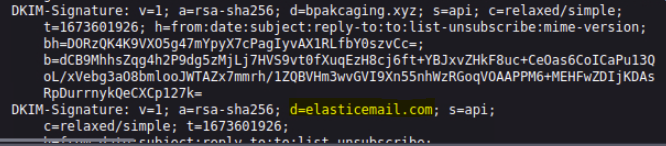

---

# 2. Password-Protected Attachment

The phishing email contained a password-protected attachment designed to evade automated scanning systems.

The password provided in the email allowed extraction of the malicious archive.

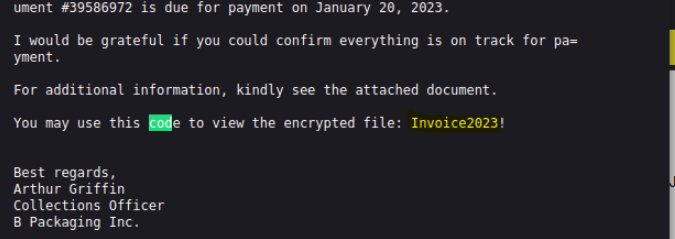

---

# 3. Malicious LNK File

The extracted attachment contained a malicious `.lnk` file. Using `lnkparse`, the shortcut file was analyzed to determine the command executed by the attacker.

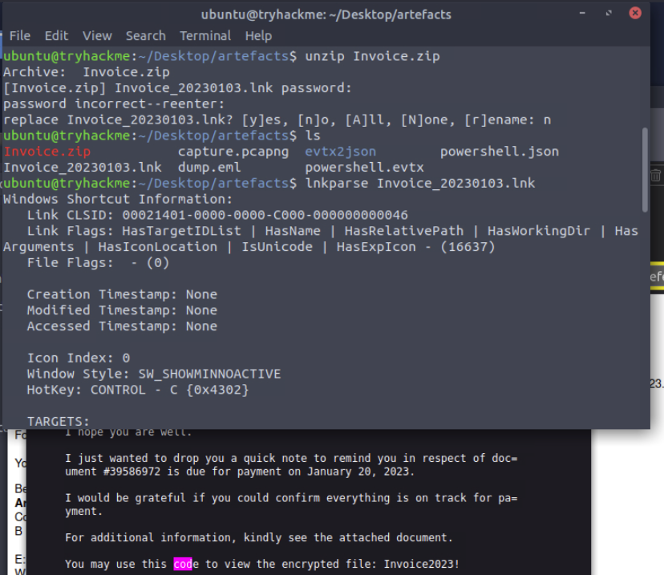

The analysis revealed that the shortcut executed a PowerShell command to download additional tools from attacker-controlled infrastructure.

---

# 4. PowerShell Activity Analysis

PowerShell logs were parsed using `jq` to analyze executed commands.

Example command used:

```bash
cat powershell.json | jq -r '.ScriptBlockText'
```

The logs revealed commands used to download enumeration tools and execute system reconnaissance.


---

# 5. Command and Control Infrastructure

Analysis of the PowerShell logs revealed connections to attacker-controlled domains used for hosting malicious payloads and C2 communication.

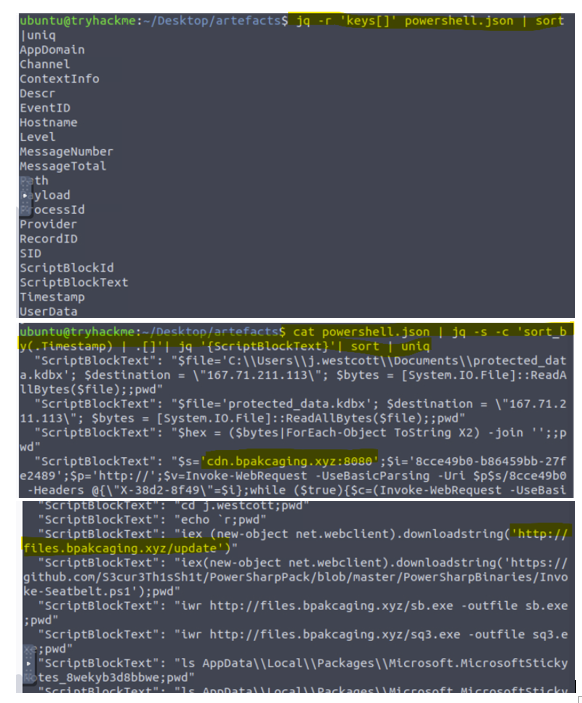

The attacker used:

```
files.bpackaging.xyz
cdn.bpackaging.xyz
```

---

# 6. Enumeration Tool Download

The attacker downloaded an enumeration tool used to gather system information.

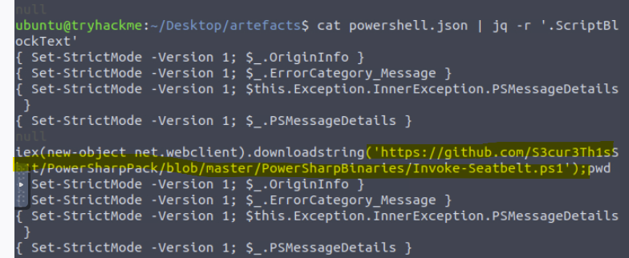

The enumeration tool identified during the investigation was **Seatbelt**, a well-known Windows security assessment tool.

---

# 7. Accessing Sensitive Files

Further analysis revealed the attacker accessed a local database used by Microsoft Sticky Notes.

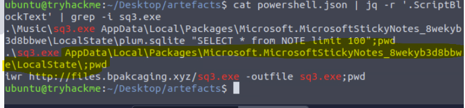

The accessed file path was:

```
C:\Users\j.westcott\AppData\Local\Packages\Microsoft.MicrosoftStickyNotes_8wekyb3d8bbwe\LocalState\plum.sqlite
```

---

# 8. Software Identification

The SQLite database accessed by the attacker belongs to Microsoft Sticky Notes.

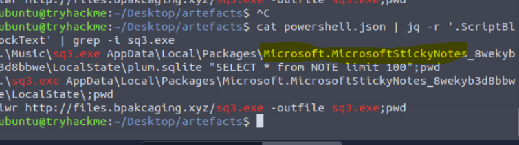

---

# 9. Extracted Sensitive File

Analysis later revealed that the attacker accessed a KeePass database file containing sensitive credentials.

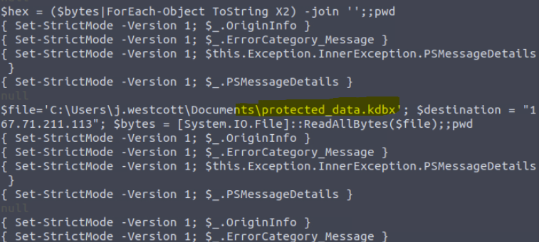

---

# 10. KeePass Credential Database

The stolen file was identified as a KeePass credential database.


KeePass databases typically store sensitive credentials including passwords and financial information.

---

# 11. DNS Data Exfiltration

Network traffic analysis revealed that the attacker exfiltrated data using DNS tunneling.

Encoded data fragments were embedded within DNS query names.

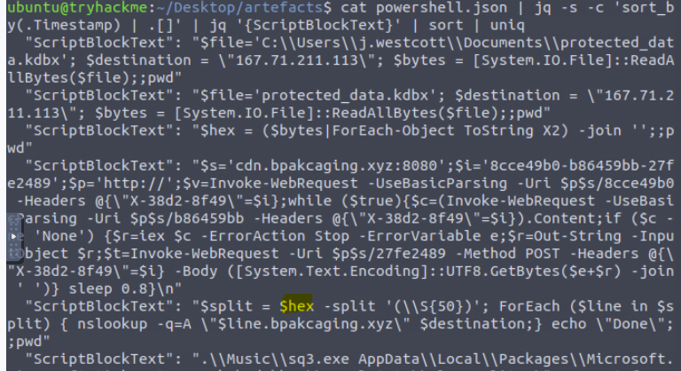

---

# 12. DNS Lookup During Exfiltration

DNS queries were observed containing encoded fragments of the stolen data.


---

# 13. Payload Hosting Infrastructure

Network traffic analysis revealed that the attacker hosted malicious payloads using a Python HTTP server.

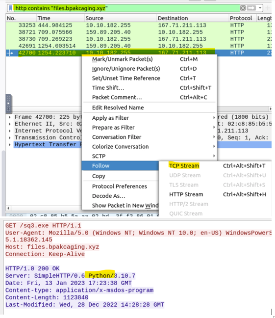

---

# 14. HTTP Command and Control

The compromised system transmitted command results back to the attacker via HTTP POST requests.

Wireshark filtering:

```bash
http.request.method == "POST"
```

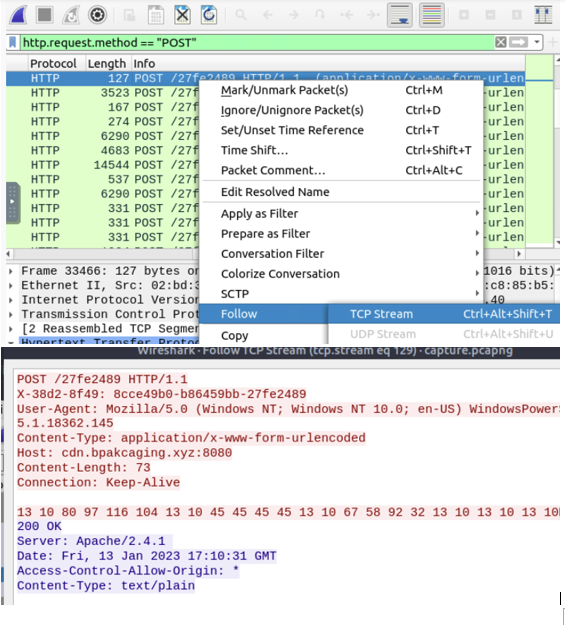

---

# 15. DNS Exfiltration Protocol

Further network analysis confirmed that the attacker used DNS to exfiltrate the stolen data.

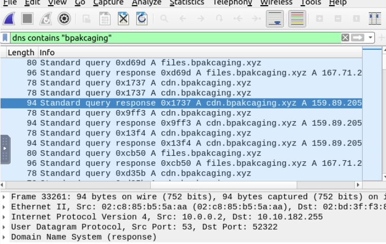

---

# 16. Recovering the Exfiltrated Data

The DNS query fragments were extracted from the network capture and reconstructed.

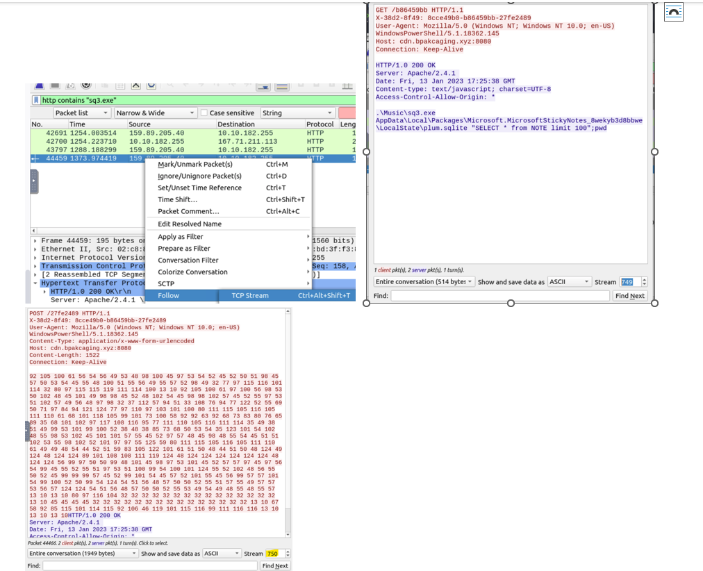

The encoded password was then decoded.

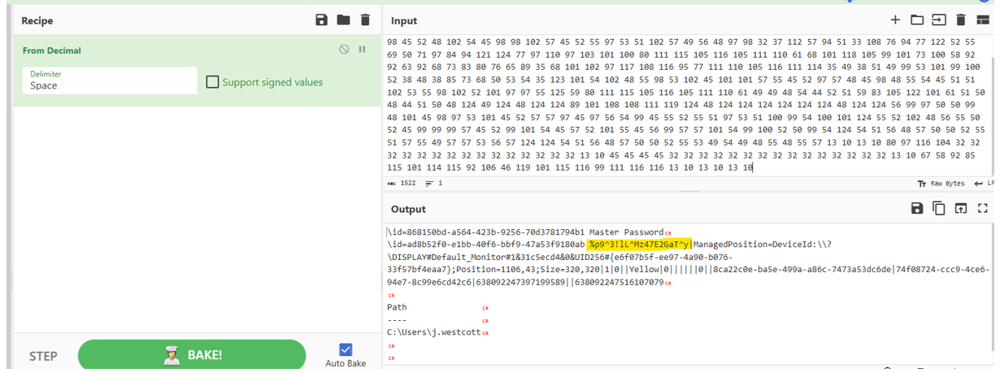

---

# 17. Sensitive Data Discovery

After reconstructing and opening the KeePass database, sensitive information was recovered.

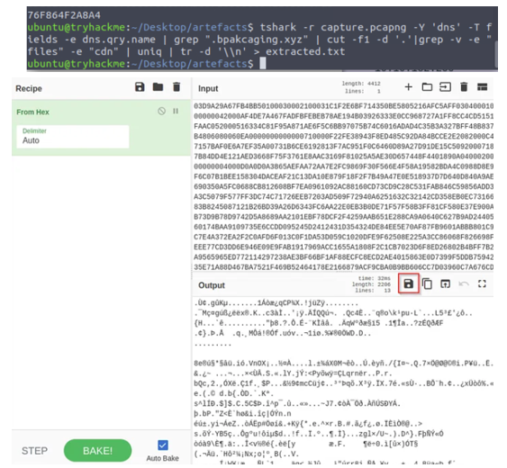

Additional sensitive information was found inside the credential database.

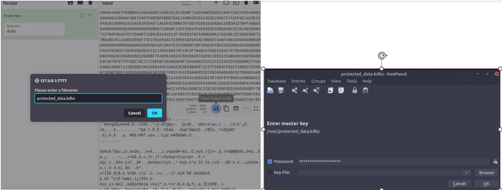

---

# Attack Chain Summary

```
Phishing Email
      ↓
Password Protected Attachment
      ↓
Malicious LNK Execution
      ↓
PowerShell Payload Execution
      ↓
Tool Download (Seatbelt)
      ↓
Sensitive File Access
      ↓
KeePass Credential Theft
      ↓
DNS Tunneling Exfiltration
```

---

# Key Findings

| Category | Finding |
|--------|--------|
Initial Access | Phishing email with malicious attachment |
Execution | Malicious LNK launching PowerShell |
Enumeration Tool | Seatbelt |
Sensitive File | Sticky Notes SQLite database |
Credential Database | KeePass `.kdbx` |
Exfiltration Method | DNS tunneling |
C2 Infrastructure | `files.bpackaging.xyz`, `cdn.bpackaging.xyz` |

---

# Lessons Learned

This investigation highlights several common attacker techniques:

- Use of password-protected attachments to evade email security scanning
- Execution of malicious PowerShell commands via shortcut files
- Use of system enumeration tools during post-exploitation
- DNS tunneling used for stealthy data exfiltration
- Targeting credential databases containing sensitive user data

Organizations should monitor for:

- Suspicious PowerShell execution
- DNS queries containing encoded data
- Unexpected outbound connections
- Access to sensitive credential stores

---

# Conclusion

This investigation successfully reconstructed the attacker’s actions from initial compromise through data exfiltration. The attacker leveraged common post-exploitation techniques and used DNS tunneling to stealthily exfiltrate sensitive information.

The analysis demonstrates the importance of monitoring PowerShell activity, network traffic patterns, and DNS anomalies to detect similar attacks in real-world environments.
