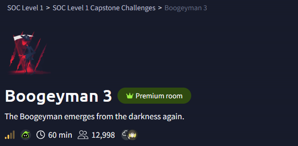

# Boogeyman 3 – SOC Investigation

## Scenario

The Boogeyman threat actor returns with a more advanced attack chain. In this investigation, we analyze telemetry from a compromised workstation to determine how the attacker executed malware, established persistence, and attempted lateral movement within the environment.

Using **Elastic SIEM logs from Winlogbeat**, we reconstruct the attacker’s actions and identify the techniques used during the attack.

---

# Tools Used

Elastic SIEM (Kibana)
Winlogbeat Windows Event Logs
Process Command-Line Analysis
Network Connection Analysis
Threat Hunting Techniques

---

# Attack Chain Summary

Initial malware execution
File implantation to a secondary location
Execution of implanted payload
Scheduled task persistence
Command and control communication
Privilege escalation through UAC bypass
Credential harvesting
Lateral movement across machines
Ransomware download and deployment

---

# Investigation Walkthrough

---

## 1. Parent Process – Stage 1 Payload

The investigation begins by identifying the process responsible for executing the initial Stage 1 payload.

Screenshot:

[01_Parent_Process_ID_Stage1_Payload](Screenshots/01_Parent_Process_ID_Stage1_Payload.png)

---

## 2. Command Line Used to Copy Malware

The Stage 1 payload attempts to copy a malicious file to another location on the compromised machine.

Screenshot:

[02_Command_Line_Value_Copy_Location](Screenshots/02_Command_Line_Value_Copy_Location.png)

---

## 3. Implanted Code Execution Command

After copying the file, the attacker executes the implanted payload using Windows binaries.

Screenshot:

[03_Full_Command_Line_Implanted_Code_Stage1](Screenshots/03_Full_Command_Line_Implanted_Code_Stage1.png)

---

## 4. Scheduled Task Persistence

To maintain persistence, the attacker creates a scheduled task that executes the malicious PowerShell payload.

Screenshot:

[04_Scheduled_Task_Name](Screenshots/04_Scheduled_Task_Name.png)

---

## 5. Command and Control Connection

Following execution of the implanted payload, the compromised host attempts to communicate with an external command and control server.

Screenshot:

[05_IP_PORT_C2_Connection](Screenshots/05_IP_PORT_C2_Connection.png)

---

## 6. UAC Bypass Process

The attacker discovers the compromised account has administrative privileges and attempts to bypass User Account Control.

Screenshot:

[06_UAC_Bypass_Process](Screenshots/06_UAC_Bypass_Process.png)

---

## 7. GitHub Link Used by Attacker

Logs reveal a GitHub link used by the attacker to retrieve additional payloads.

Screenshot:

[07_GitHub_Link](Screenshots/07_GitHub_Link.png)

---

## 8. Username Hash Artifact

Credential artifacts appear in the logs showing hashed account information.

Screenshot:

[08_Username_Hash](Screenshots/08_Username_Hash.png)

---

## 9. Remote Share Access

The attacker accesses a remote share as part of lateral movement activity.

Screenshot:

[09_Remote_Share_File](Screenshots/09_Remote_Share_File.png)

---

## 10. Attacker Created Credentials

Evidence shows the attacker created a new username and password on the system.

Screenshot:

[10_Attacker_New_Username_Password](Screenshots/10_Attacker_New_Username_Password.png)

---

## 11. Target Machine Hostname

Analysis reveals the hostname of the machine targeted during lateral movement.

Screenshot:

[11_Hostname_Attackers_Target_Machine](Screenshots/11_Hostname_Attackers_Target_Machine.png)

---

## 12. Parent Command – Lateral Movement

Further command-line analysis shows how the attacker initiated lateral movement.

Screenshot:

[12_Process_Parent_Command_Lateral_Movement](Screenshots/12_Process_Parent_Command_Lateral_Movement.png)

---

## 13. Username Hash – Second Machine

Credential artifacts were also discovered on a second compromised machine.

Screenshot:

[13_Username_Hash_Second_Machine](Screenshots/13_Username_Hash_Second_Machine.png)

---

## 14. Account Dumped by Attacker

Logs indicate the attacker attempted to dump account credentials.

Screenshot:

[14_Account_Attacker_Dumped](Screenshots/14_Account_Attacker_Dumped.png)

---

## 15. Ransomware Download Link

The final stage of the attack reveals the link used to download ransomware onto the compromised system.

Screenshot:

[15_Link_Used_Download_Ransomware](Screenshots/15_Link_Used_Download_Ransomware.png)

---

# Key Takeaways

This investigation highlights several techniques commonly used by attackers during multi-stage compromises:

Use of legitimate Windows utilities for malware execution
File implantation and execution
Scheduled task persistence mechanisms
Command and control communication with external servers
Privilege escalation through UAC bypass techniques
Credential dumping
Lateral movement between systems
Ransomware deployment

Understanding these behaviors allows SOC analysts to detect and respond to similar threats more effectively.

---

# Related Investigations

Boogeyman Investigation
Boogeyman 2 Investigation

SOC Investigation Repository

https://github.com/chrisalee27-dotcom/SOC-Level-1-Capstone

