# Boogeyman 3 – SOC Investigation

## Scenario

The Boogeyman threat actor returns with a more advanced attack chain. In this investigation, we analyze telemetry from a compromised workstation to identify how the attacker executed malware, established persistence, and attempted lateral movement across the network.

Using Elastic SIEM logs collected through Winlogbeat, we reconstruct the attacker’s actions and determine the techniques used to maintain access and pivot through the environment.

---

# Tools Used

* Elastic SIEM (Kibana)
* Winlogbeat Windows Event Logs
* Process Command-Line Analysis
* Network Connection Analysis
* Threat Hunting Methodology

---

# Attack Chain Summary

| Stage                 | Description                                       |
| --------------------- | ------------------------------------------------- |
| Initial Execution     | Stage 1 malware executed on compromised host      |
| File Implantation     | Malware copied malicious file to another location |
| Execution             | Implanted file executed with Windows binaries     |
| Persistence           | Scheduled task created for persistence            |
| C2 Communication      | Malware attempted outbound connection             |
| Privilege Escalation  | Attacker executed a UAC bypass                    |
| Credential Access     | Account data was dumped                           |
| Lateral Movement      | Attacker attempted pivot to another machine       |
| Ransomware Deployment | Malicious payload downloaded                      |

---

# Investigation Walkthrough

---

## 1. Parent Process – Stage 1 Payload

The investigation begins by identifying the process responsible for launching the initial Stage 1 payload.

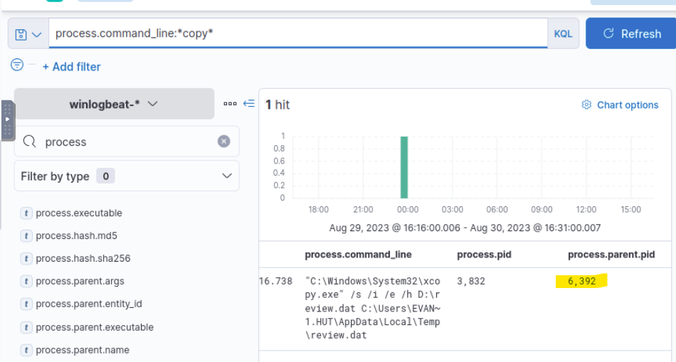

---

## 2. Command Line Used to Copy Malware

The Stage 1 payload attempts to implant a malicious file to another location on the host system using Windows utilities.

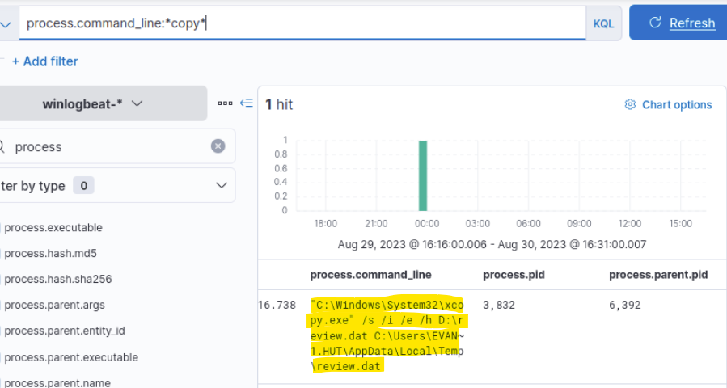

---

## 3. Implanted Code Execution Command

After copying the file, the attacker executes the implanted payload. Process command-line logs reveal how the code was executed.

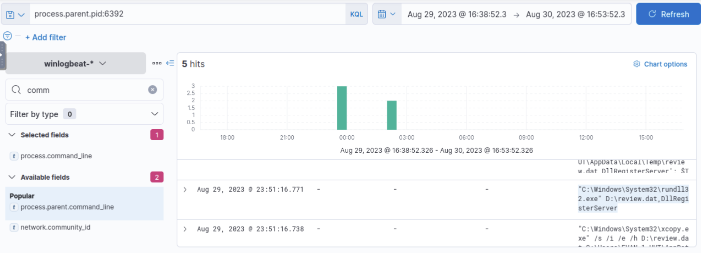

---

## 4. Scheduled Task Persistence

To maintain persistence, the attacker creates a scheduled task that executes the malicious PowerShell payload.

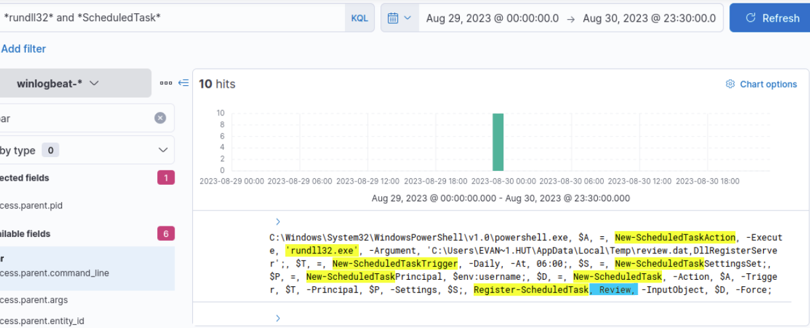

---

## 5. Command and Control Connection

Following execution of the implanted file, the compromised host attempts to communicate with an external command and control server.

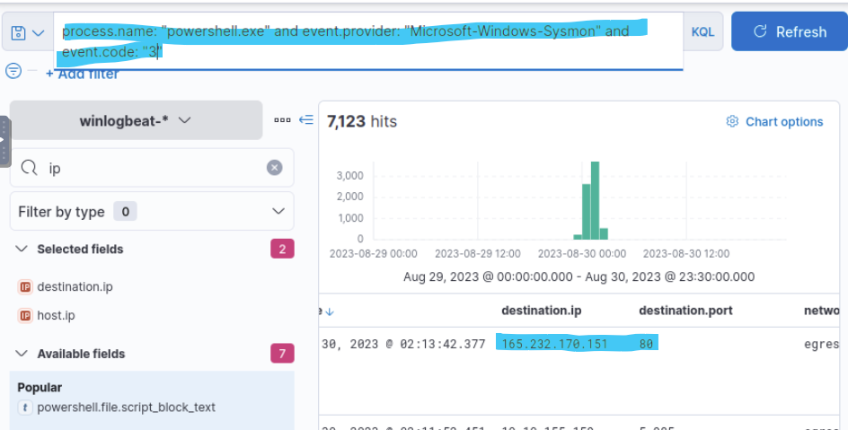

---

## 6. UAC Bypass Process

Because the compromised user has administrator privileges, the attacker attempts to escalate privileges using a UAC bypass technique.

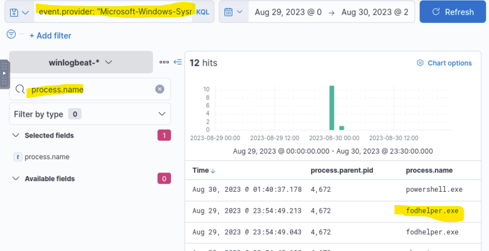

---

## 7. GitHub Link Used by Attacker

During the investigation we identify a GitHub link used by the attacker to retrieve additional scripts or payloads.

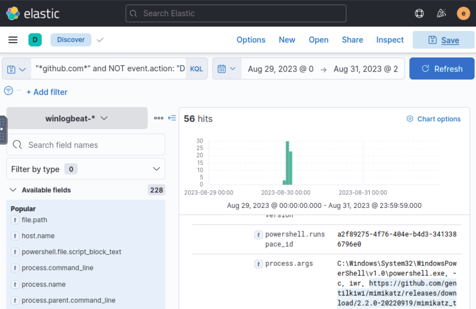

---

## 8. Username Hash Artifact

Credential artifacts appear within the logs, revealing hashed account data associated with attacker activity.

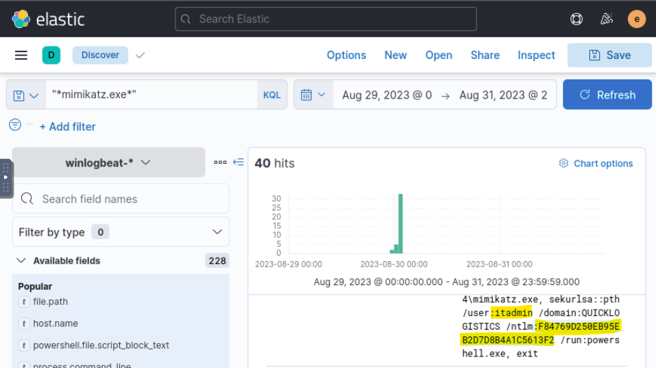

---

## 9. Remote Share Access

Evidence shows the attacker accessed a remote network share, indicating potential lateral movement activity.

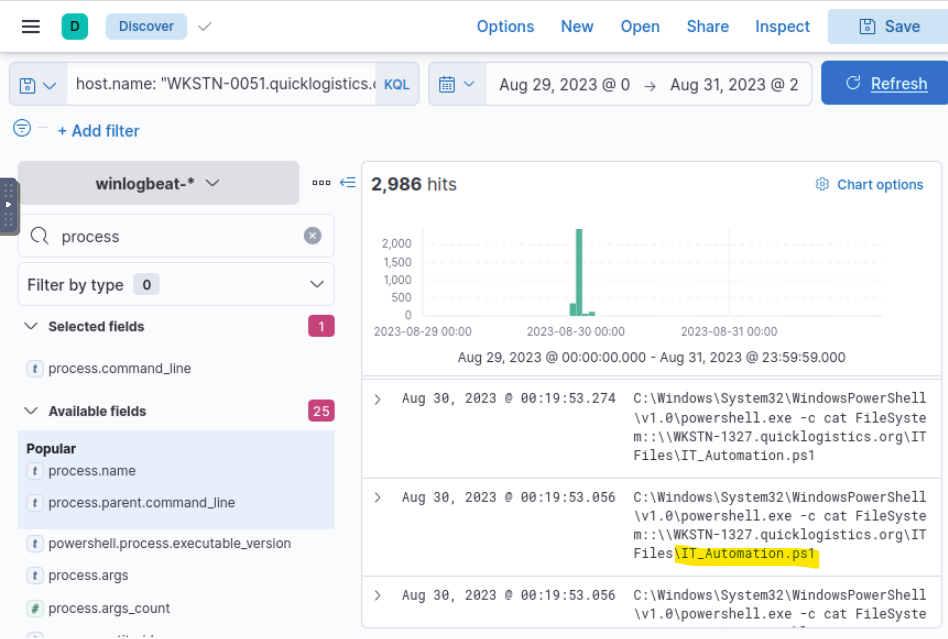

---

## 10. Attacker Created Credentials

Logs reveal the attacker created a new username and password on the system.

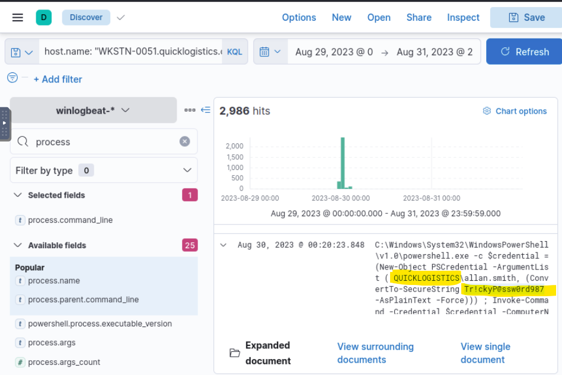

---

## 11. Target Machine Hostname

Network activity reveals the hostname of the system targeted during lateral movement.

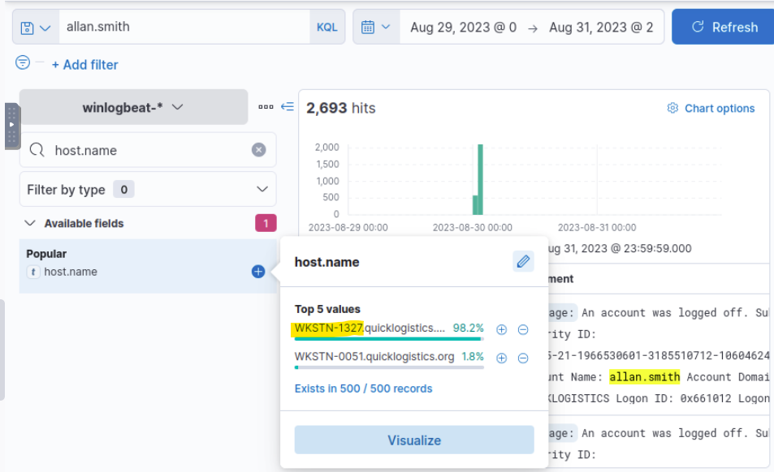

---

## 12. Parent Command Used for Lateral Movement

Further command-line analysis shows the command used by the attacker to move laterally across machines.

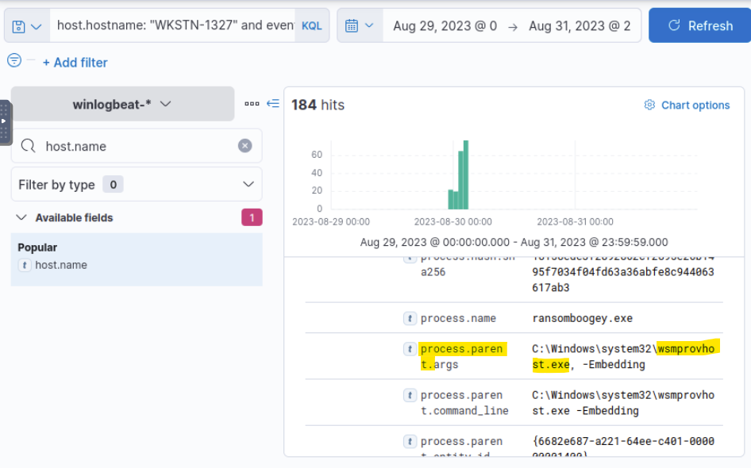

---

## 13. Username Hash – Second Machine

Credential artifacts were also discovered on a second machine involved in the attack.

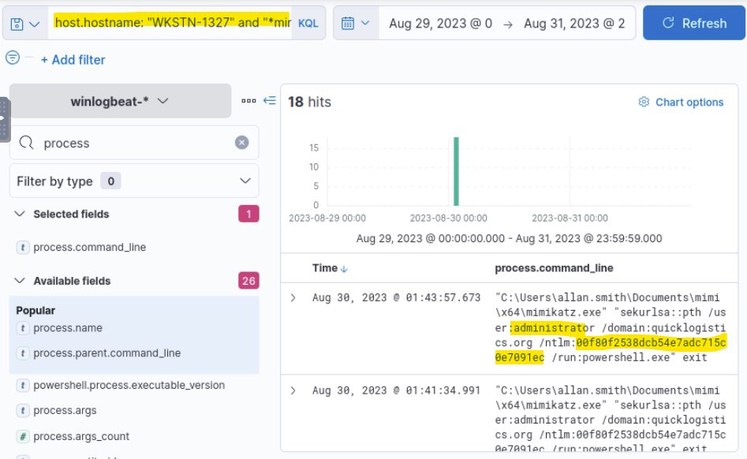

---

## 14. Account Dumped by Attacker

Evidence indicates the attacker attempted to dump account information from the compromised host.

---

## 15. Ransomware Download Link

Finally, the investigation reveals the link used to download ransomware onto the compromised machine.

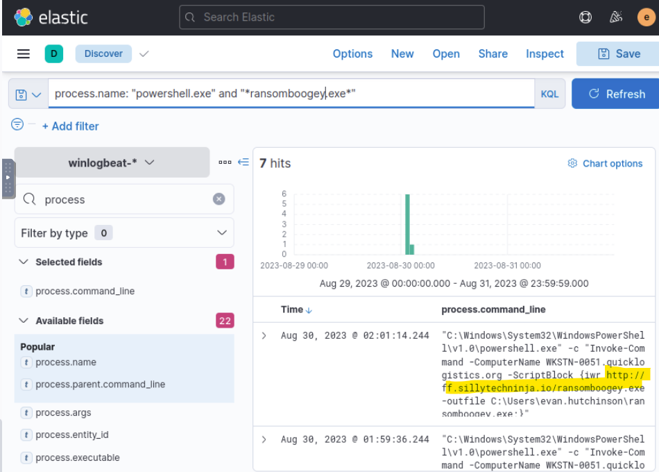

---

# Key Takeaways

This investigation demonstrates several common attacker techniques used during multi-stage compromises:

* Malware execution using legitimate Windows binaries
* File implantation and execution
* Scheduled task persistence
* Command and Control communication
* Privilege escalation via UAC bypass
* Credential dumping
* Lateral movement across hosts
* Ransomware deployment

Understanding these behaviors allows SOC analysts to detect similar attack chains and respond more effectively to emerging threats.

---

# Related Investigations

Boogeyman Investigation
Boogeyman 2 Investigation

SOC Investigation Repository:

https://github.com/chrisalee27-dotcom/SOC-Level-1-Capstone

